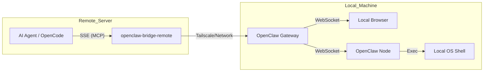

# OpenClaw MCP Bridge

[](https://opensource.org/licenses/MIT)
[](https://bun.sh)

A high-performance bridge that exposes [OpenClaw](https://openclaw.ai) capabilities as a [Model Context Protocol (MCP)](https://modelcontextprotocol.io) server.

This bridge allows remote AI agents (like OpenCode, Cursor, or Windsurf running on remote servers) to securely delegate local tasks—such as browser automation and shell execution—to an OpenClaw Gateway running on your local machine (e.g., MacBook) via Tailscale or any network connection.

## Why this exists

When working on powerful remote servers (GPU clusters, cloud instances, etc.), AI agents are "blind" to your local environment. This bridge provides the "eyes and hands" by connecting the remote agent to your local OpenClaw instance.

- **Local Browser Control**: Navigate, screenshot, click, and scrape pages on your local machine.
- **Local Shell Access**: Execute commands on your local OS (say, open, pbcopy, hardware control).
- **Secure Authentication**: API key via HTTP headers + OpenClaw Ed25519 challenge-response signing.
- **Hybrid Routing**: Intelligently routes commands between the OpenClaw Gateway and connected Nodes.

## Architecture



## Quick Start

### 1. Install (on your local machine, e.g. MacBook)

```bash
curl -fsSL https://raw.githubusercontent.com/lucas-jo/openclaw-bridge-remote/main/install.sh | bash
```

The installer will:
- Clone the repo to `~/openclaw-bridge-remote`
- Install dependencies via Bun
- Auto-detect your `OPENCLAW_GATEWAY_TOKEN`
- Generate a random `BRIDGE_API_KEY`
- Create a `.env` file with all settings

### 2. Verify the bridge is running

```bash
# From your remote machine (replace with your local machine's IP)
curl http://<your-local-ip>:3100/health
# Expected: {"status":"ok","gateway":true,"version":"0.1.0"}
```

### 3. Get the values you need for MCP config

You need two pieces of information from the `.env` file on your local machine:

```bash
# On your local machine (where the bridge is running)
cat ~/openclaw-bridge-remote/.env
```

Note down:
- **`BRIDGE_API_KEY`** — The secret key for authenticating MCP clients
- **Your local machine's IP** — Use `tailscale ip -4` (Tailscale) or your LAN IP

### 4. Configure your AI agent (on the remote machine)

> **Important**: Use `headers` with `x-api-key` for authentication, NOT query parameters in the URL.
> The MCP SDK's SSE transport drops query parameters from the URL when making POST requests,
> which causes authentication failures.

**OpenCode** (`~/.config/opencode/config.json`):

```json
{
  "mcp": {
    "openclaw-remote": {
      "type": "remote",
      "url": "http://<your-local-ip>:3100/sse",
      "headers": {
        "x-api-key": "<your-BRIDGE_API_KEY>"
      },
      "enabled": true
    }
  }
}
```

**Cursor / Windsurf / Claude Code** (MCP config):

```json
{
  "mcpServers": {
    "openclaw-remote": {
      "type": "remote",
      "url": "http://<your-local-ip>:3100/sse",
      "headers": {
        "x-api-key": "<your-BRIDGE_API_KEY>"
      }
    }
  }
}
```

**Local agents (stdio mode)** — For agents running on the same machine as the bridge:

```json
{
  "mcpServers": {
    "openclaw-local": {
      "command": "bun",
      "args": ["run", "start", "--transport=stdio"],
      "cwd": "~/openclaw-bridge-remote"
    }
  }
}
```

### 5. Test the connection

After configuring your agent, try calling any tool (e.g. `openclaw_gateway_call` with `method: "node.list"`) to verify the bridge is working end-to-end.

## Configuration Reference

The `.env` file controls the bridge behavior:

| Variable                 | Description                                     | Default          | How to find                                                      |
| ------------------------ | ----------------------------------------------- | ---------------- | ---------------------------------------------------------------- |
| `OPENCLAW_GATEWAY_TOKEN` | Auth token for connecting to OpenClaw Gateway    | **Required**     | Run `openclaw config get gateway.auth.token` on your local machine |
| `BRIDGE_API_KEY`         | Secret key for authenticating remote MCP clients | (Auto-generated) | Check `.env` file; pass via `x-api-key` header                   |
| `OPENCLAW_GATEWAY_HOST`  | OpenClaw Gateway host                            | `127.0.0.1`      | Usually localhost                                                |
| `OPENCLAW_GATEWAY_PORT`  | OpenClaw Gateway port                            | `18790`          | Run `openclaw config get gateway.port`                           |
| `BRIDGE_PORT`            | Port for the MCP SSE server                      | `3100`           | Any available port                                               |

## Running the Bridge

### SSE Mode (for remote agents)

```bash
bun run start             # Default: SSE mode
bun run start --transport=sse  # Explicit
```

### Stdio Mode (for local agents)

```bash
bun run start --transport=stdio
```

## Available MCP Tools

| Tool                        | Description                                                     |
| --------------------------- | --------------------------------------------------------------- |
| `openclaw_browser`          | Unified browser control (navigate, click, type, tabs, open, evaluate) |
| `openclaw_browser_screenshot` | Capture browser screenshot (PNG/JPEG)                          |
| `openclaw_browser_snapshot` | Get accessibility tree for AI reasoning (with smart pruning)    |
| `openclaw_system_run`       | Execute shell commands on the local machine                     |
| `openclaw_gateway_call`     | Direct RPC access to OpenClaw Gateway (e.g. `node.list`)        |

## Documentation

- **[RECIPES.md](./RECIPES.md)**: Connectivity options (Tailscale, SSH Tunneling, Cloudflare Tunnel).
- **[SETUP.md](./SETUP.md)**: Detailed architecture, protocol details, and troubleshooting.

## Development

```bash
bun run dev       # Watch mode (auto-restart on changes)
bun run lint      # Check code style
bun run format    # Auto-fix code style
bun run typecheck # Check for type errors
```

### Releasing

1. Update version in `package.json`.
2. Push a tag:

```bash
git tag v0.2.1
git push origin v0.2.1
```

The [Release Workflow](./.github/workflows/release.yml) automatically runs checks and creates a GitHub Release.

## License

MIT © [Lucas Jo](https://github.com/lucas-jo)
