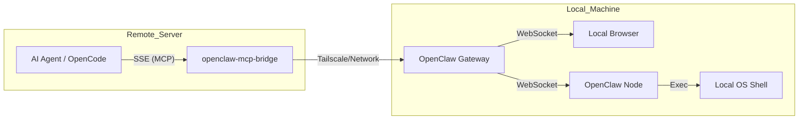

# OpenClaw MCP Bridge

[](https://opensource.org/licenses/MIT)
[](https://bun.sh)

A high-performance bridge that exposes [OpenClaw](https://openclaw.ai) capabilities as a [Model Context Protocol (MCP)](https://modelcontextprotocol.io) server. 

This bridge allows remote AI agents (like OpenCode, Cursor, or Windsurf running on remote servers) to securely delegate local tasks—such as browser automation and shell execution—to an OpenClaw Gateway running on your local machine (e.g., MacBook) via Tailscale or any network connection.

## 🚀 Why this exists?

When working on powerful remote servers (DGX, AWS EC2, etc.), AI agents are "blind" to your local environment. This bridge provides the "eyes and hands" by connecting the remote agent to your local OpenClaw instance.

- **Local Browser Control**: Navigate, screenshot, click, and scrape pages on your local machine.
- **Local Shell Access**: Execute commands on your local OS (say, open, pbcopy, hardware control).
- **Secure Authentication**: Implements OpenClaw's Ed25519 challenge-response signing protocol.
- **Hybrid Routing**: Intelligently routes commands between the OpenClaw Gateway and connected Nodes.

## 🏗 Architecture



## 🛠 Prerequisites

- [Bun](https://bun.sh) runtime installed.
- [OpenClaw](https://openclaw.ai) installed and running on your local machine.
- (Optional) [Tailscale](https://tailscale.com) for secure remote access without port forwarding.

## 📦 Installation

```bash
git clone https://github.com/lucasjo/openclaw-mcp-bridge.git
cd openclaw-mcp-bridge
bun install
```

## ⚙️ Configuration

Set the following environment variables:

| Variable | Description | Default |
|----------|-------------|---------|
| `OPENCLAW_GATEWAY_TOKEN` | Your OpenClaw Gateway auth token | **Required** |
| `OPENCLAW_GATEWAY_HOST` | Local OpenClaw Gateway host | `127.0.0.1` |
| `OPENCLAW_GATEWAY_PORT` | Local OpenClaw Gateway port | `18790` |
| `BRIDGE_PORT` | Port for the MCP SSE server | `3100` |

## 🏃 Running the Bridge

```bash
OPENCLAW_GATEWAY_TOKEN=your_token_here bun run start
```

## 🤖 Adding to your Agent

### OpenCode / Cursor / Windsurf
Add the following MCP configuration:

```json
{
  "mcpServers": {
    "openclaw-bridge": {
      "type": "remote",
      "url": "http://<your-local-ip>:3100/sse"
    }
  }
}
```

## 🛠 Available MCP Tools

| Tool | Description |
|------|-------------|
| `openclaw_browser_navigate` | Navigate local browser to a URL |
| `openclaw_browser_snapshot` | Get accessibility tree for AI reasoning |
| `openclaw_browser_screenshot` | Capture local browser screen |
| `openclaw_system_run` | Execute shell commands on the local machine |
| `openclaw_nodes_list` | List connected OpenClaw nodes |
| `openclaw_gateway_call` | Direct RPC access to OpenClaw Gateway |

## 📜 License

MIT © [Lucas Jo](https://github.com/lucasjo)
